# Project_template

Это шаблон для решения проектной работы. Структура этого файла повторяет структуру заданий. Заполняйте его по мере работы над решением.

# Задание 1. Анализ и планирование

<aside>

Чтобы составить документ с описанием текущей архитектуры приложения, можно часть информации взять из описания компании и условия задания. Это нормально.

</aside

### 1. Описание функциональности монолитного приложения

**Управление отоплением:**

- Пользователи могут ([handlers/sensors.go](apps/smart_home/handlers/sensors.go)):
  - Добавлять, изменять и удалять датчики через REST API (`CreateSensor`, `UpdateSensor`, `DeleteSensor`).
  - Обновлять значение температуры, активировать/деактивировать датчик (`UpdateSensorValue`: `value`, `status`).
  - Обновлять параметры датчиков, включая значение температуры и активности (`UpdateSensor`: `SensorUpdate struct`).

- Система поддерживает:
  - Хранение информации о датчиках (таблица `sensors` в [init.sql](apps/smart_home/init.sql), [models/sensor.go](apps/smart_home/models/sensor.go)).
  - REST API для управления датчиками ([handlers/sensors.go](apps/smart_home/handlers/sensors.go)).
  - Интеграцию с внешним сервисом температуры ([services/temperature_service.go](apps/smart_home/services/temperature_service.go)).

**Мониторинг температуры:**

- Пользователи могут:
  - Получать список всех датчиков и их значения температуры (([handlers/sensors.go](apps/smart_home/handlers/sensors.go)), `GetSensors`).
  - Запрашивать температуру по конкретному датчику или местоположению (([handlers/sensors.go](apps/smart_home/handlers/sensors.go)), `GetSensorByID`).

- Система поддерживает:
  - Получение температуры с внешнего API ([services/temperature_service.go](apps/smart_home/services/temperature_service.go)).
  - Обновление температуры в базе данных ([db/db.go](apps/smart_home/db/db.go)).
  - Проверку состояния API с помощью health-check ([main.go](apps/smart_home/main.go), `/health`).

### 2. Анализ архитектуры монолитного приложения

- _Язык программирования_
  - Основное приложение написано на Go ([go.mod](apps/smart_home/go.mod), [main.go](apps/smart_home/main.go)).

- _База данных_
  - PostgreSQL ([docker-compose.yml](apps/docker-compose.yml)), её структура описана в [init.sql](apps/smart_home/init.sql).

- _Взаимодействие между компонентами_
  - Приложение и база данных запускаются в отдельных Docker-контейнерах и взаимодействуют через сеть `smarthome-network`.
  - Основное приложение работает с базой данных через драйвер `pgxpool` для PostgreSQL (`import github.com/jackc/pgx/v5/pgxpool`, строка подключения – переменная `DATABASE_URL`).
  - Получение актуальных температурных данных поисходит через интеграцию с внешним сервисом ([services/temperature_service.go](apps/smart_home/services/temperature_service.go)), который должен запускаться в отдельном Docker-контейнере (не реализован).
  - Бизнес-логика (обработка запросов, обработка данных) реализована внутри монолита
  - Взаимодействие с пользователем и внешними системами осуществляется через REST API. Документация – коллекция запросов Postman ([smarthome-api.postman_collection.json](apps/smarthome-api.postman_collection.json))
  - Взаимодействие внутри системы синхронное, запросы обрабатываются последовательно.

- _Контейнеризация и запуск_
  - Запуск мультиконтейнерного приложения (основное приложение, база данных и сервис температуры) происходит в Docker Compose ([docker-compose.yml](apps/docker-compose.yml)).
  - База данных инициализируется автоматически при первом запуске контейнера Postgres:
    - Имя инициализируемой базы данных `smarthome` указано в [docker-compose.yml](apps/docker-compose.yml), в сервисе `postgres`
    - Дальнейшая инициализация выполняется с помощью скрипта [init.sql](apps/smart_home/init.sql) (выражение для создания базы данных `CREATE DATABASE smarthome;` было закомментировано).

- _Особенности монолитного приложения_
  - Т.к. приложение является единым исполняемым файлом:
    - _масштабируемость_ ограничена — невозможно масштабировать отдельные части. Увеличение производительности потребует запуска нескольких копий приложения.
    - _развёртываемость_ низкая – любые изменения кода требуют полной пересборки и перезапуска приложения.

### 3. Определение доменов и границы контекстов

В текущем монолитном приложении можно выделить:

- _Домен «Управление устройствами» (Device Management)_
  - Работа с датчиками: добавление, изменение, удаление, активация/деактивация устройств.
  - Граница контекста: REST API CRUD-операций с датчиками ([handlers/sensors.go](apps/smart_home/handlers/sensors.go)), хранение о них информации ([db/db.go](apps/smart_home/db/db.go)).

- _Домен «Мониторинг температуры» (Temperature Monitoring)_
  - Работа с полученной с датчиков температурой: сбор, хранение и предоставление текущих данных.
  - Граница контекста: REST API для получения текущих данных ([handlers/sensors.go](apps/smart_home/handlers/sensors.go), `GetTemperatureByLocation`), интеграция с внешним сервисом температуры (обращение к [services/temperature_service.go](apps/smart_home/services/temperature_service.go)).

- _Домен «Интеграция с внешними сервисами» (External Integration)_
  - Взаимодействие с внешним API (сейчас только получение актуальных данных температуры).
  - Граница контекста: сервис интеграции с внешним API ([services/temperature_service.go](apps/smart_home/services/temperature_service.go)).

- _Домен «Мониторинг состояния системы» (System Health)_
  - Проверка состояния приложения, базы данных, доступности сервисов.
  - Граница контекста: эндпоинт health-check, мониторинг состояния ([main.go](apps/smart_home/main.go)).
  - Не смотря на то, что сейчас это одна простая функция, её предметную область можно отнести в отдельный домен приложения, отвечающий за диагностику приложения, его мониторинг (health-checks, телеметрия, метрики, работа с внешними системами: Prometheus, Grafana и др.). Выделение этого домена отделяет бизнес-логику от эксплуатации приложения.

\* Домены «Мониторинг температуры» и «Интеграция с внешними сервисами» в текущей реализации пересекаются, т.к. для получения температуры система обращается к сервису температуры напрямую, из обработчика мониторинга, что создаёт зависимость логики (домена) мониторинга от кода интеграции с внешними сервисами (получение, первичная обработка данных извне - унифицированная обработка ошибок, логирование и др.)

### **4. Проблемы монолитного решения**

- _Ограниченная масштабируемость_: невозможно независимо масштабировать отдельные части приложения.
- _Низкая развёртываемость_: любые изменения требуют новой сборки и перезапуска.
- _Сложность тестирования_: высокая связанность компонентов, отсутствие у них чётких границ означает их высокую зависимость друг от друга, поэтому даже незначительные изменения одного компонента могут потребовать тестирования всего приложения целиком.
- _Низкая отказоустойчивость_: сбой одного компонента может повлечь остановку, сбой всего приложения.
- _Сложность внедрения новых технологий_: высокая связанность снижает возможность обновления, рефакторинга, замены  отдельных компонентов в том числе с использованием , компонентов сложно внедрять новые технологии или обновлять отдельные части без риска для всего приложения.
- _Сложность обновления архитектуры_: изменения требуют больших усилий и затрагивают множество частей кода.
- _Трудности командной работы_: параллельная работа команд затруднена из-за зависимостей между модулями.

### 5. Визуализация контекста системы — диаграмма С4

[./diagrams/context/as-is.puml](./diagrams/context/as-is.puml)

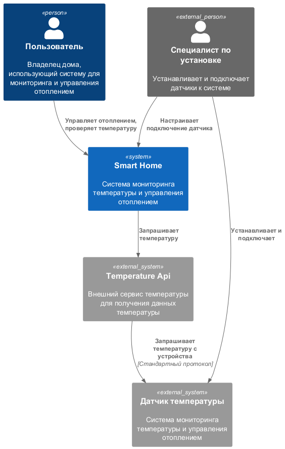

# Задание 2. Проектирование микросервисной архитектуры

**Диаграмма контейнеров (Containers)**

[./diagrams/container/smarthome_to-be.puml](./diagrams/container/smarthome_to-be.puml)

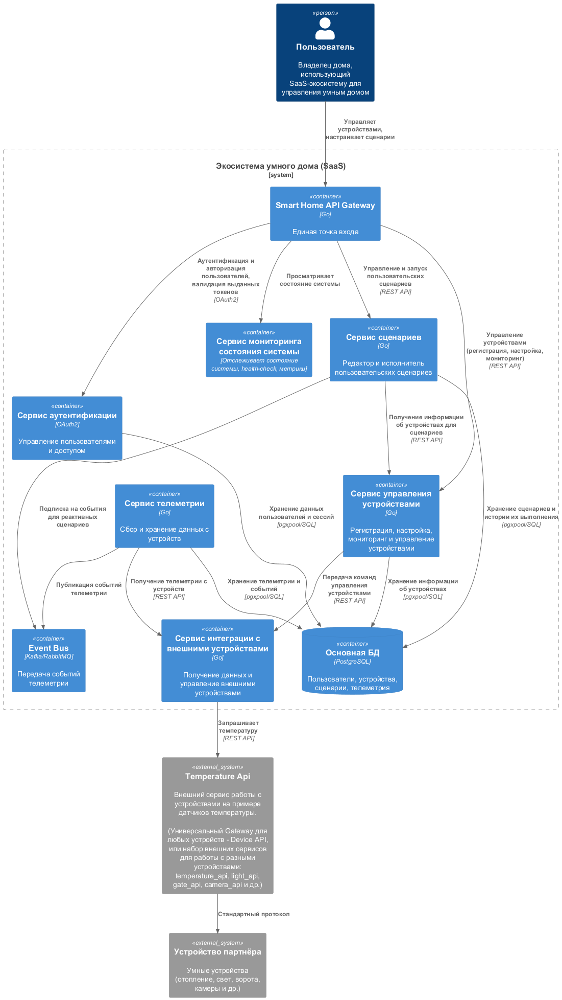

**Диаграмма компонентов (Components)**

Вот примеры C4-диаграмм компонентов (**Component Diagram**) для ключевых микросервисов вашей архитектуры. Каждый микросервис разбит на основные компоненты с кратким описанием их ответственности.

1. **Сервис управления устройствами**

[./diagrams/component/device_mgmt_to-be.puml](./diagrams/component/device_mgmt_to-be.puml)

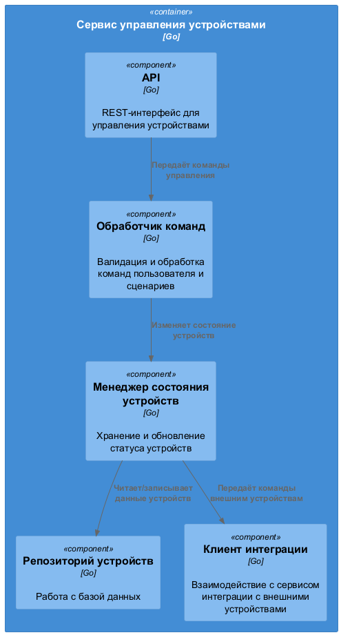


2. **Сервис телеметрии**

[./diagrams/component/telemetry_to-be.puml](./diagrams/component/telemetry_to-be.puml)

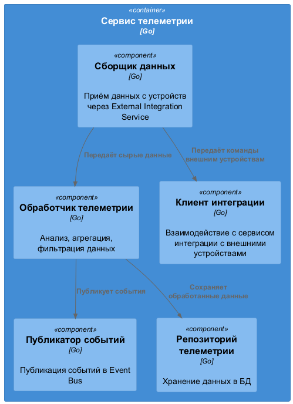

3. **Сервис сценариев**

[./diagrams/component/scenario_to-be.puml](./diagrams/component/scenario_to-be.puml)

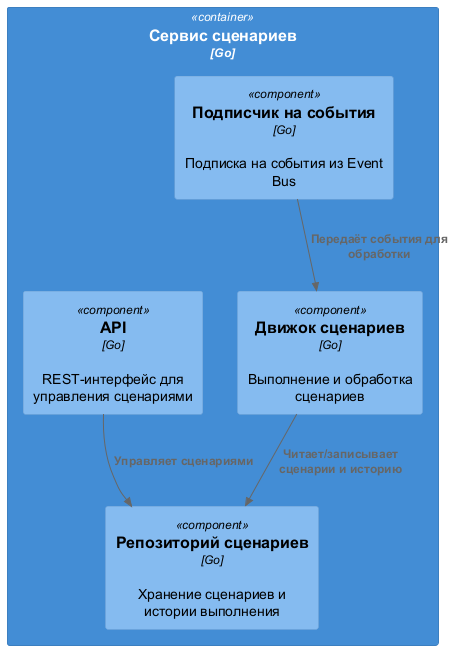

4. **Сервис интеграции с внешними устройствами**

[./diagrams/component/external_integration_to-be.puml](./diagrams/component/external_integration_to-be.puml)

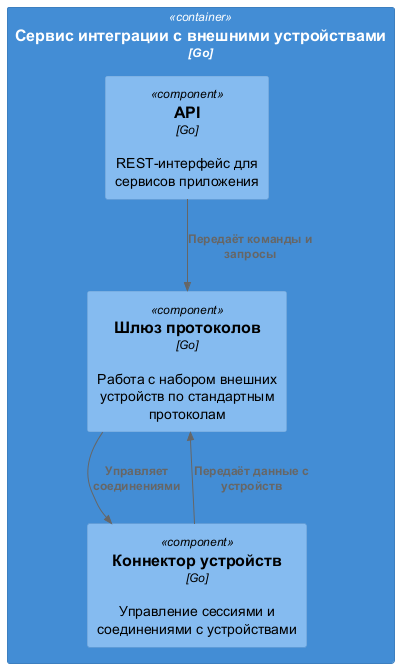

5. **Сервис аутентификации**

[./diagrams/component/auth_to-be.puml](./diagrams/component/auth_to-be.puml)

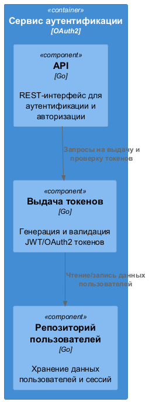

6. **Smart Home API Gateway**

[./diagrams/component/api_to-be.puml](./diagrams/component/api_to-be.puml)

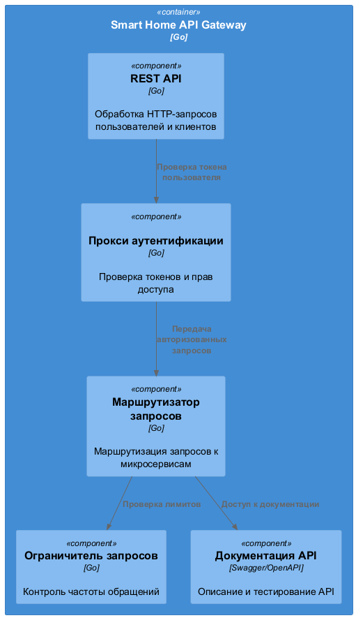

7. **Сервис мониторинга состояния системы**

[./diagrams/component/health_to-be.puml](./diagrams/component/health_to-be.puml)

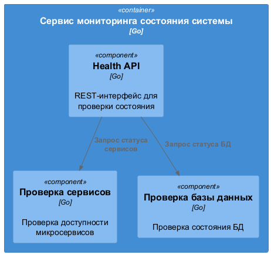

8. **Event Bus (Kafka/RabbitMQ)**

[./diagrams/component/queue_to-be.puml](./diagrams/component/queue_to-be.puml)

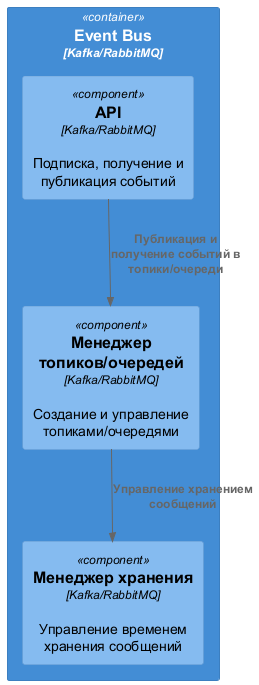

---

**Диаграмма кода (Code)**

1. Классы датчиков температуры

[./diagrams/code/sensor_to-be.puml](./diagrams/code/sensor_to-be.puml)

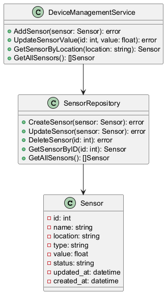

2. Классы интеграции с внешними сервисами

[./diagrams/code/external_integration_to-be.puml](./diagrams/code/external_integration_to-be.puml)

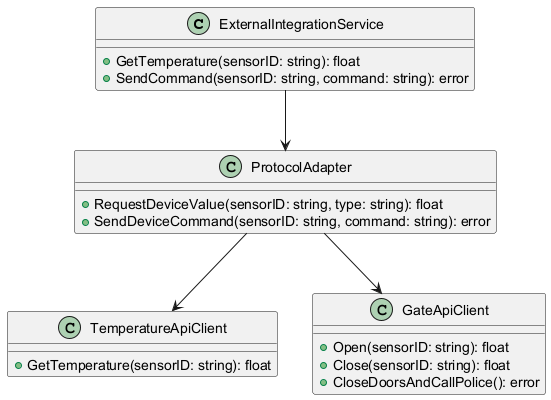

3. Классы аутентификации и авторизации

[./diagrams/code/auth_to-be.puml](./diagrams/code/auth_to-be.puml)

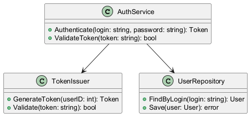

4. Последовательность получения температуры с внешнего API

[./diagrams/code/temperature-sequence_to-be.puml](./diagrams/code/temperature-sequence_to-be.puml)

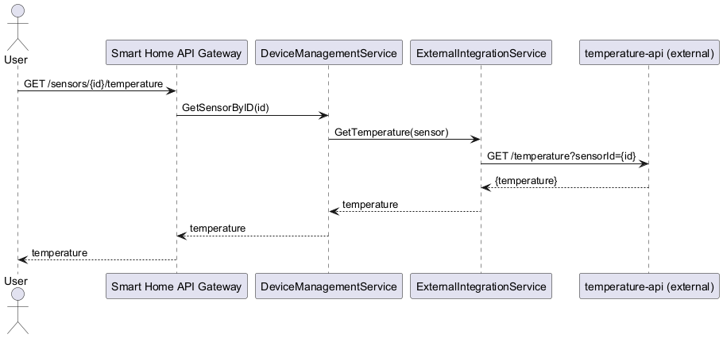

# Задание 3. Разработка ER-диаграммы

[./diagrams/er/main.puml](./diagrams/er/main.puml)

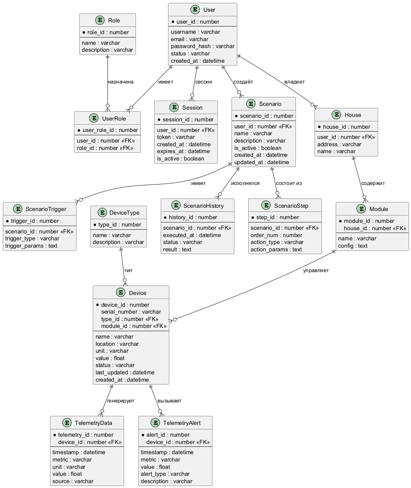

Диаграмма основных таблиц, зависимых от `User`.

---

[./diagrams/er/health.puml](./diagrams/er/health.puml)

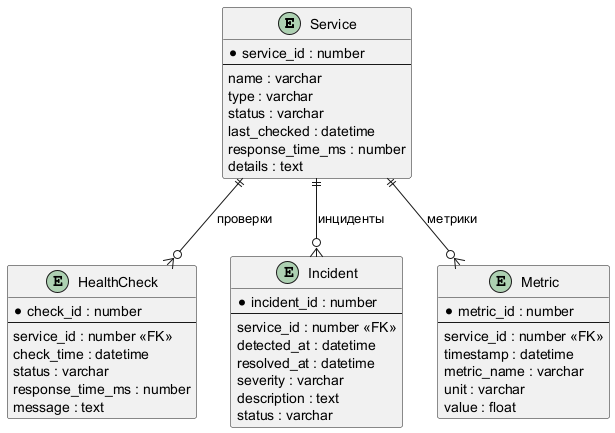

Диаграмма таблиц для сценариев выделена отдельно, т.к. загромождала основную. По этой же причине на диаграмме контекста и контейнеров сервис мониторинга не был подключён к микросервисам, чьё состояние отслеживает.

# Задание 4. Создание и документирование API

### 1. Тип API

Для взаимодействия микросервисов будет использоваться REST API:
- оно распространено и является стандартом для интеграции микросервисов
- поэтому оно просто в реализации и поддержке
- оно не поддерживает состояние, что упрощает масштабирование, позволяя запускать сразу несколько независимых экземпляров микросервиса
- оно легко тестируется в браузере или в специализированном Postman

### 2. Документация API

1. **Сервис управления устройствами**

[./openapi/device_mgmt_to-be.yaml](./openapi/device_mgmt_to-be.yaml)

2. **Сервис телеметрии**

[./openapi/telemetry_to-be.yaml](./openapi/telemetry_to-be.yaml)

3. **Сервис сценариев**

[./openapi/scenario_to-be.yaml](./openapi/scenario_to-be.yaml)

4. **Сервис интеграции с внешними устройствами**

[./openapi/external_integration_to-be.yaml](./openapi/external_integration_to-be.yaml)

5. **Сервис аутентификации**

[./openapi/auth_to-be.yaml](./openapi/auth_to-be.yaml)

6. **Smart Home API Gateway**

[./openapi/api_to-be.yaml](./openapi/api_to-be.yaml)

7. **Сервис мониторинга состояния системы**

[./openapi/health_to-be.yaml](./openapi/health_to-be.yaml)

# Задание 5. Работа с docker и docker-compose

Перейдите в apps.

Там находится приложение-монолит для работы с датчиками температуры. В README.md описано как запустить решение.

Вам нужно:

1) сделать простое приложение temperature-api на любом удобном для вас языке программирования, которое при запросе /temperature?location= будет отдавать рандомное значение температуры.

Locations - название комнаты, sensorId - идентификатор названия комнаты

```
	// If no location is provided, use a default based on sensor ID
	if location == "" {
		switch sensorID {
		case "1":
			location = "Living Room"
		case "2":
			location = "Bedroom"
		case "3":
			location = "Kitchen"
		default:
			location = "Unknown"
		}
	}

	// If no sensor ID is provided, generate one based on location
	if sensorID == "" {
		switch location {
		case "Living Room":
			sensorID = "1"
		case "Bedroom":
			sensorID = "2"
		case "Kitchen":
			sensorID = "3"
		default:
			sensorID = "0"
		}
	}
```

2) Приложение следует упаковать в Docker и добавить в docker-compose. Порт по умолчанию должен быть 8081

3) Кроме того для smart_home приложения требуется база данных - добавьте в docker-compose файл настройки для запуска postgres с указанием скрипта инициализации ./smart_home/init.sql

Для проверки можно использовать Postman коллекцию smarthome-api.postman_collection.json и вызвать:

- Create Sensor
- Get All Sensors

Должно при каждом вызове отображаться разное значение температуры

Ревьюер будет проверять точно так же.


